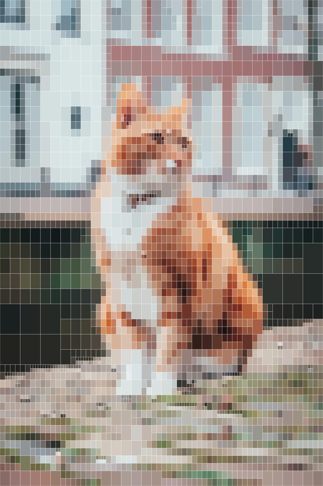
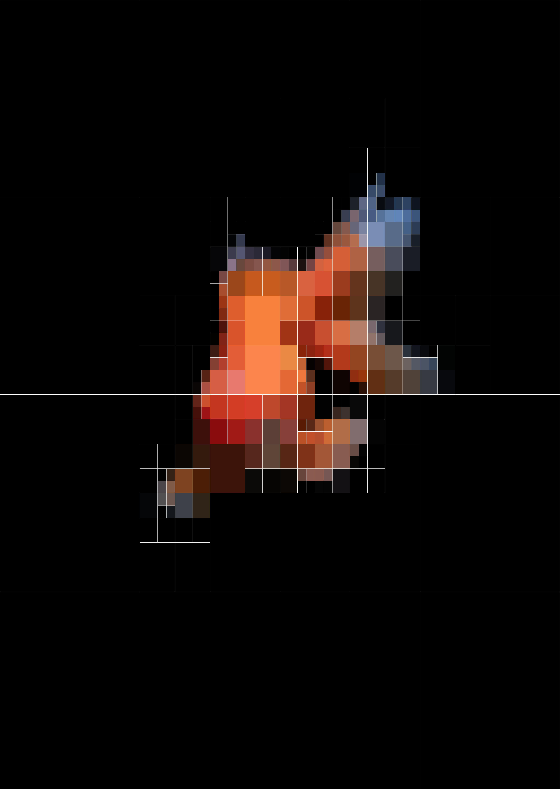

# img-compressor

Fast and efficient quad-tree based image compression CLI made in Rust.

## Overview

`img-compressor` uses a quad-tree algorithm to compress images by iteratively subdividing regions based on color variance. The tool can generate both static compressed images and animated GIFs showing the compression process.

<div align="center">

https://github.com/user-attachments/assets/48412f55-83f8-4447-abed-4b5e09fdf3a4

</div>  

## Algorithm Details

The quad-tree compression algorithm works by:

1. **Initial State**: Start with the entire image as a single region
2. **Variance Calculation**: Calculate color variance for each region using prefix sum matrices for O(1) queries
3. **Priority Selection**: Use a max-heap to always split the region with highest variance
4. **Subdivision**: Split selected regions into 4 quadrants
5. **Iteration**: Repeat until desired number of iterations

### Time Complexity Analysis

**Overall Time Complexity: `O(W × H + k × log k)`**

Where:
- `W × H` = image dimensions (width × height)
- `k` = number of iterations

#### Breakdown by Phase:

**1. Image Loading & Preprocessing: `O(W × H)`**
- Read and convert each pixel: `O(W × H)`
- Build prefix sum matrices: `O(W × H)`
- Build squared prefix sums: `O(W × H)`

**2. Per-Iteration Processing: `O(log k)`**
- Priority queue operations: `O(log k)` for heap operations
- Variance calculations: `O(1)` per query (4 queries per iteration)
- Node splitting and storage: `O(1)`

*Note: Variance calculation is typically the bottleneck in quad-tree algorithms, but this implementation achieves O(1) variance queries by preprocessing the image into prefix sum matrices.*

**3. Final Rendering: `O(W × H)`**
- Traverse quad-tree and render pixels: `O(W × H)`

#### Performance Characteristics:

- **Typical usage**: Dominated by `O(W × H)` - image processing is the bottleneck
- **Very large iteration counts**: Still efficient due to `log k` growth in quad-tree operations
- **Scaling**: Doubling iterations doesn't double the work due to logarithmic growth

#### Comparison to Naive Approach:
- **Naive variance calculation**: `O(k × W × H)` total
- **This implementation**: `O(W × H + k × log k)` total
- **Speedup**: Massive improvement for large k or large images

**Space Complexity: `O(W × H + k)`**
- Image data and prefix sums: `O(W × H)`
- Quad-tree nodes: `O(k)`
- Priority queue: `O(k)`  

## Examples

|original | 100 Iterations           | 1,000 Iterations          | 20,000 Iterations          |
| :---: | :---: | :---: | :---: |
|  |   |   |   |
| 3.1 MB | 524 KB | 712 KB | 1.1 MB |

### Images with outlines

The following images with outlines shows how the algorithm prioritizes splitting up regions with the highest color variance first. Notice how the algorithm prioritizes splitting regions covering the cat's fur and facial features, as well as the more detailed and colorful areas of the background, while leaving the uniform, solid-colored background sections as large unsplit blocks.

| 10 iterations | 100 iterations | 1,000 iterations |
| :---: | :---: | :---: |
|  |  |  |

### Speed + Size

This example demonstrates the speed and efficiency of the program. Notice how the speed of the program scales efficiently with processing 20x more iterations only taking 12% longer, demonstrating the algorithms logarithmic time complexity. Additionally, more iterations produce higher quality results with larger file sizes due to the additional quad-tree subdivisions.

| original image | 5,000 iterations | 100,000 iterations |
| :---: | :---: | :---: |
|  |  |  |
| 6235 by 9353 pixels (6.91 MB) | 6.8 seconds (2.52 MB) | 7.6 seconds (4.15 MB) |

### GIF Example

| original gif | 100 iterations (outlined) | 1000 iterations | an animation of the process up to 500 iterations (delta 10 - 50 frames) |
| :---: | :---: | :---: | :---: |
|  | |  |  |

## Installation

### From Source
```bash
git clone https://github.com/mouizahmed/img-compressor.git
cd img-compressor
cargo build --release
```

The binary will be available at `target/release/img-compressor` (or `img-compressor.exe` on Windows).

## Command Line Options

```
USAGE:
    img-compressor [OPTIONS] --iterations <N> <FILE>

ARGUMENTS:
    <FILE>    Input image file

OPTIONS:
    --iterations <N>        Number of refinement iterations
    --output-file <FILE>    Output file path (optional)
    --outline <HEX>         Outline color in hex format (e.g. #000000) (optional)
    --gif-delta <N>         Save algorithm process to GIF, frame every N iterations
    -h, --help              Print help information
```

## Usage

### Basic Compression
```bash
# Compress an image with 50 iterations
./img-compressor input.jpg --iterations 50

# Output: input-compressed.jpg
```

### Custom Output File
```bash
# Specify custom output filename
./img-compressor input.jpg --iterations 100 --output-file result.jpg
```

### Add Outline
```bash
# Add black outline to show quad-tree structure
./img-compressor input.jpg --iterations 75 --outline "#000000"

# Add red outline
./img-compressor input.jpg --iterations 75 --outline "#FF0000"
```

### Generate Animated GIF
```bash
# Create GIF with frame every 5 iterations
./img-compressor input.jpg --iterations 50 --gif-delta 5

# Create smooth animation with frame every iteration
./img-compressor input.jpg --iterations 20 --gif-delta 1 --output-file smooth.gif

# GIF with outline
./img-compressor input.jpg --iterations 30 --gif-delta 3 --outline "#FFFFFF" --output-file outlined.gif
```

## Performance Tips

- **Always use release mode**: `cargo run --release`
- **Start small**: Begin with 50-100 iterations, increase gradually
- **Large images**: Use fewer iterations initially to test
- **GIF generation**: Slower than static images, use smaller `--gif-delta` values

## File Format Support

**Input formats:** JPEG, PNG, BMP, TIFF, WebP, GIF, and other formats supported by the `image` crate

**Output formats:** 
- Static: JPEG, PNG (determined by input format or --output-file extension)
- Animated: GIF

## License

[LICENSE](LICENSE)

## Acknowledgements

- [QuadTreeImageCompression](https://github.com/Inspiaaa/QuadTreeImageCompression) - Original inspiration
- [Quad tree structures for image compression applications](https://www.sciencedirect.com/science/article/abs/pii/0306457392900636)
